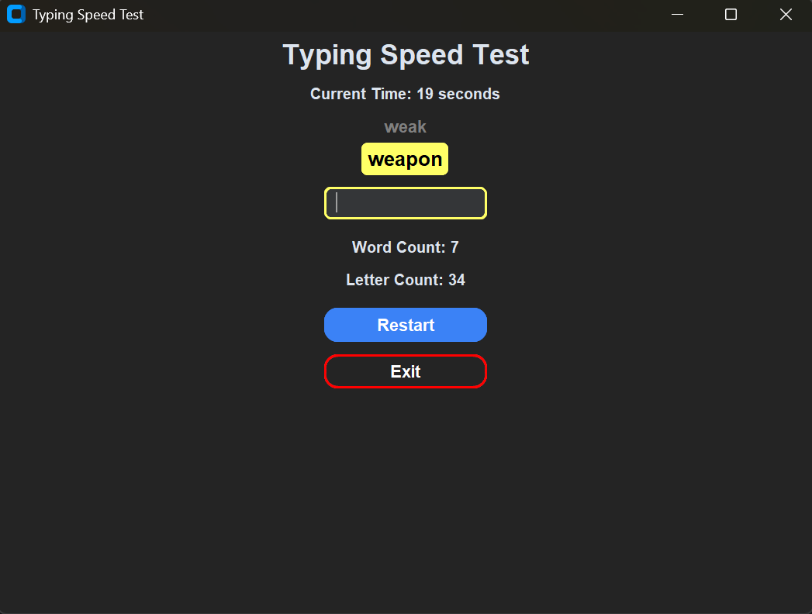
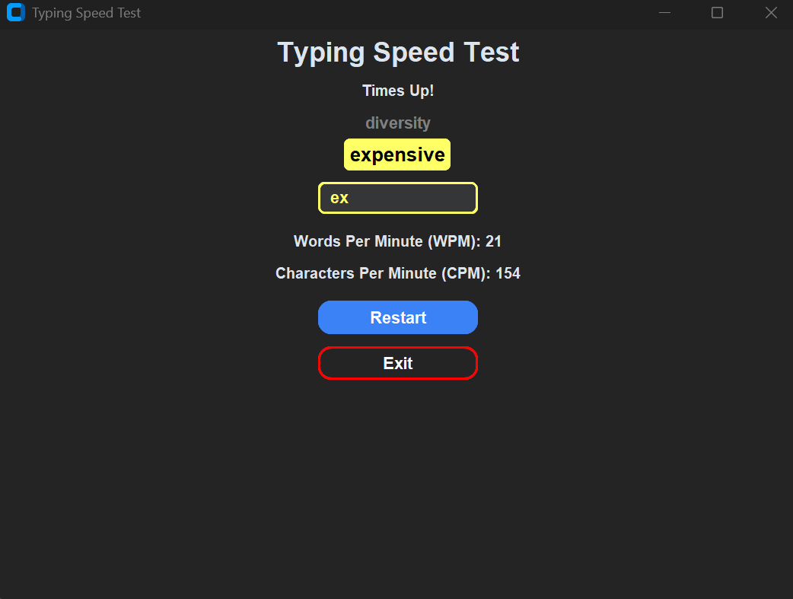

## ⌨️ Typing Speed Test Desktop App


A **Modern desktop Typing Speed Test Application** built using CustomTkinter.  
It measures typing performance in real time, including Words Per Minute **(WPM)** and Characters Per Minute **(CPM)**,
using a dynamically generated word list.

---

### 🪶 Features:

- Real time typing test interface
- Live 60 second countdown timer
- Calculates:
    - Words Per Minute **(WPM)**
    - Characters Per Minute **(CPM)**
- Displays Current word and Previous word for tracking
- Randomized large word generation using **wordfreq**
- Input validation, only correct words are counted
- Clean and modern Dark Mode UI
- Restart Button to reset the test
- Exit Button to exit the app

---

### ⚙️ Tech Stack / Libraries:

- **Python** – Backend
- **CustomTkinter** – GUI framework (modern Tkinter)
- **wordfreq** – Word dataset for realistic and large words
- **random** – Word shuffling

---

### 📌Example Screenshots:

#### Main Interface:



#### After Time Ends:



---

### 🚀 How to Run:

```text
pip install -r requirements.txt
python main.py
```